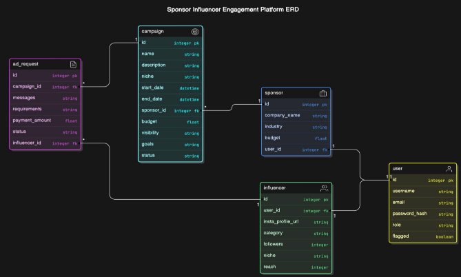

**Student Details:** 

- **Name:** Mayank Jain 
- **Student ID:** 22f3003071 

**Project Details:** 

- **Project Title:** Influencer Engagement and Sponsorship Coordination Platform 
- The project involves building a web application that allows sponsors and influencers to manage their campaigns and ad requests effectively. The primary challenge was to design a system that could handle different user roles (Admin, Sponsor, Influencer) with specific functionalities like profile management, ad request processing, and user administration. 
- **Approach:** 
  - The application was structured using Flask as the backend framework, leveraging SQLAlchemy for database interactions. The core focus was on developing robust routes to handle various user actions, implementing role-based access control, and ensuring the integrity of the data. Filters and query optimizations were implemented to enhance user experience in viewing and managing data. 

**Frameworks and Libraries Used:** 

- **Flask:** Web framework used to build the backend of the application. 
- **Flask-RESTful**: Flask extension to build REST Api 
- **SQLAlchemy:** ORM (Object-Relational Mapping) used for database interactions. 
- **Jinja2:** Template engine for rendering HTML templates. 
- **Bootstrap:** Used for designing responsive front-end layouts. 
- **Werkzeug:** Provides password hashing and secure session management. 

**ER Diagram:** 

**API Resource Endpoints** 

- **User API:** 
  - **GET**  */api/users/<int:user\_id>* **:** Retrieves user details by user ID.** 
- **Campaign API:** 
  - **GET**  /api/campaigns : Retrieves all campaigns.** 
  - **GET**  /api/campaigns/<int:campaign\_id> : Retrieves a specific campaign by ID.** 
  - **POST**  /api/campaigns : Creates a new campaign.** 
  - **DELETE**  /api/campaigns/<int:campaign\_id> : Deletes a campaign by ID. 
  - **PUT**  /api/campaigns/<int:campaign\_id>/complete : Marks a campaign as completed and updates related ad requests. 
- **Ad Request API:** 
  - **GET**  /api/ad\_requests/<int:ad\_request\_id> : Retrieves an ad request by ID. 
  - **POST**  /api/ad\_requests : Creates a new ad request. 
  - **PATCH**  /api/ad\_requests/<int:ad\_request\_id> : Updates an ad request by ID.** 
  - **DELETE**  /api/ad\_requests/<int:ad\_request\_id> : Deletes an ad request by ID. 
- **Search Influencers API:** 
  - **GET**  /api/search/influencers : Searches for influencers based on criteria such as name, niche, or followers. 
  - **GET**  /api/search/influencers/<int:influencer\_id> : Retrieves an influencer by ID. 

**Backend Routes:** 

- **Home:** 
  - **/index/users** [GET]: View the home page of the platform. 
- **Admin Management:** 
  - **/admin/users** [GET]: View and filter sponsors and influencers. 
  - **/admin/flag\_user** [POST]: Flag or unflag a user. 
- **User Registration and Profile Management:** 
  - **/register** [GET, POST]: Register a new user (Sponsor or Influencer). 
  - **/profile/<int:user\_id>** [GET]: View the profile of a user. 
  - **/edit\_profile/sponsor/<int:user\_id>** [GET, POST]: Edit a sponsor's profile. 
  - **/edit\_profile/influencer/<int:user\_id>** [GET, POST]: Edit an influencer's profile. 
- **Dashboard Management:** 
  - **/sponsor/dashboard/<int:user\_id>** [GET]: Render the sponsor dashboard. 
  - **/influencer/dashboard/<int:user\_id>** [GET]: Render the influencer dashboard. 
  - **/admin/dashboard/<int:user\_id>** [GET]: Render the admin dashboard. 
- **Campaign Management:** 
  - **/campaigns** [GET]: Get all campaigns of the sponsor. 
  - **/getCampaign/<int:campaign\_id>** [GET]: Get Details of a particular campaign. 
  - **/create\_campaign** [POST]: Create a campaign by calling API. 
  - **/delete\_campaign/<int:campaign\_id>** [POST]: Delete a campaign by calling API. 
  - **/editCampaign/<int:campaign\_id>** [GET, POST]: Route for rendering and posting edit campaign form. 
- **Ad Request Management:** 
  - **/ad\_requests** [GET]: Get Ad Requests of an influencer. 
  - **/acceptAdRequest/<int:adRequestId>** [POST]: Accept an ad request. 
  - **/completeAdRequest/<int:adRequestId>** [POST]: Mark an ad request as completed. 
  - **/rejectAdRequest/<int:adRequestId>** [POST]: Reject an ad request. 
  - **/update\_payment\_terms** [POST]: Negotiate payment of an ad request. 
- **User Session Management:** 
  - **/logout** [GET]: Log out the current user. 
  - **/login** [GET, POST]: Login the specific users. 

**Presentation Video:** 

- **Drive Link:** [https://drive.google.com/file/d/1Xc4yUea2oZRYFyhKz7aNL0PgHJOZjGJp/view?usp=drive_link ](https://drive.google.com/file/d/1Xc4yUea2oZRYFyhKz7aNL0PgHJOZjGJp/view?usp=drive_link)
